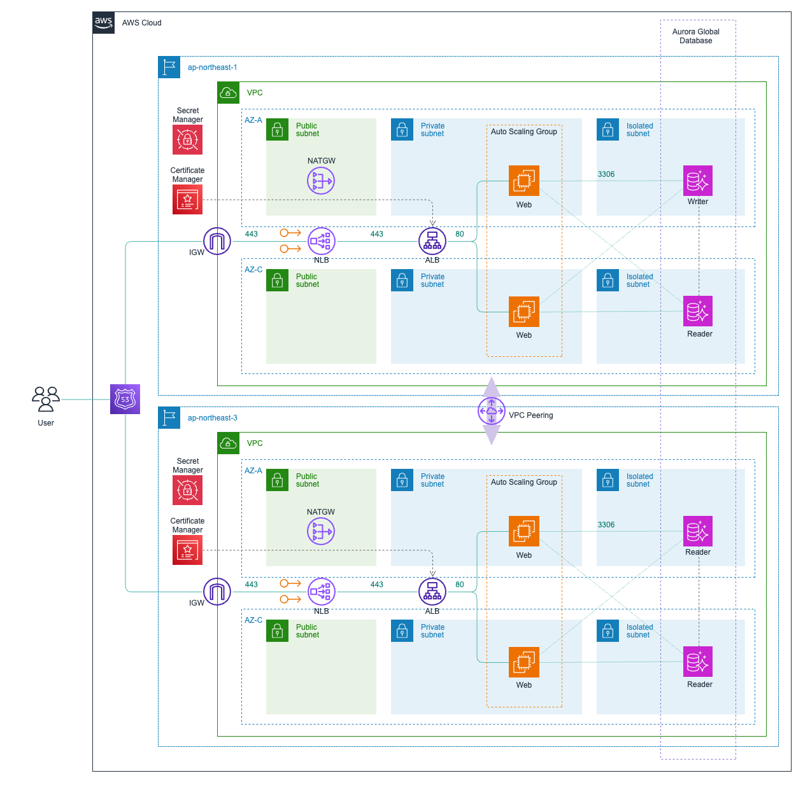
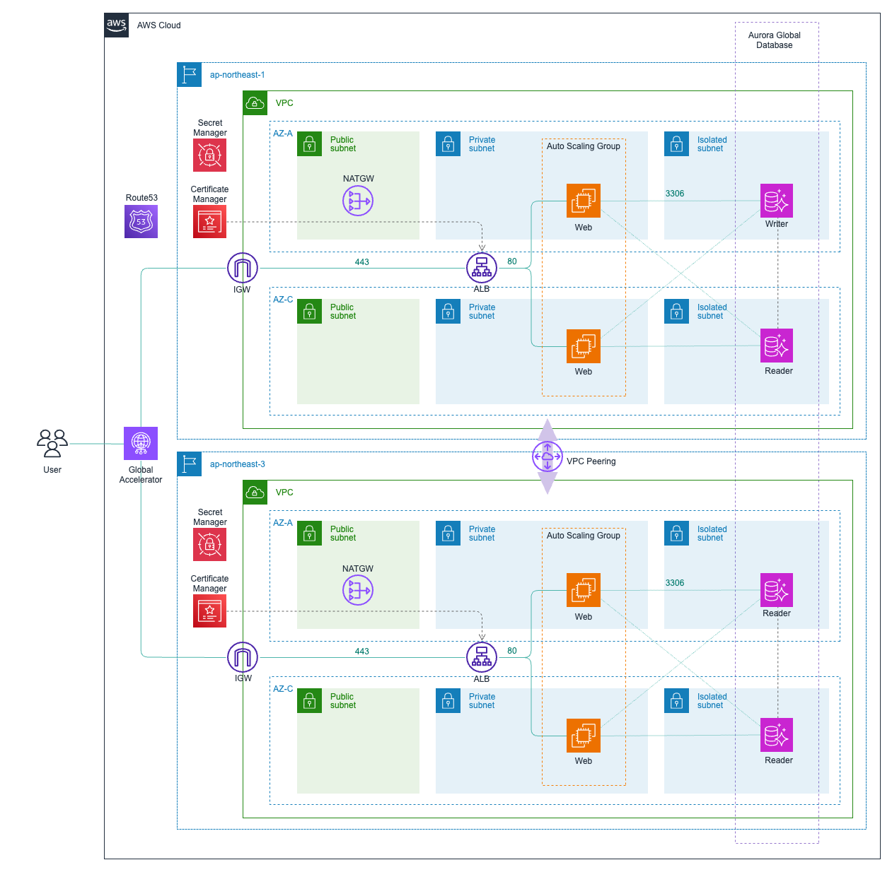

cdk-dr-sample
=============

Sample CDK application for configure multi-region disaster recovery environment with AWS.

Requirements:

- Static IP addresses disclosure

Branch
------

- pt1-nlb: Configuration pattern using NLB
- pt2-ga: Configuration pattern using AWS GLobal Accelerator

Diagram
-------

- NLB Pattern



- AWS Global Accelerator Pattern



Prerequisites
-------------

First, define the context as follows:

```json
{
  ...
  "context": {
    ...
    "owner": "user",
    "serviceName": "myapp",
    "hostedZoneName": "your-domain.com"
  }
}
```

Usage
-----

Deploy resources with the following command:

```sh
npx cdk synth
npx cdk deploy
```
